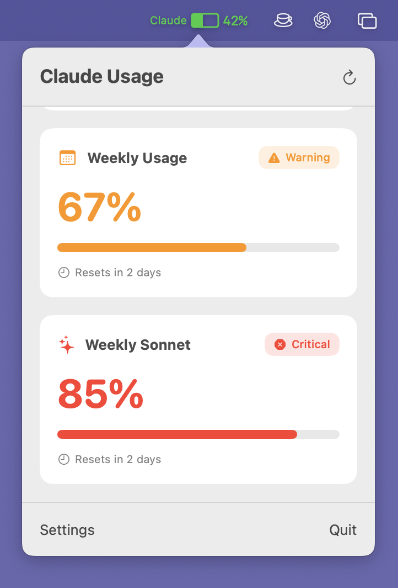
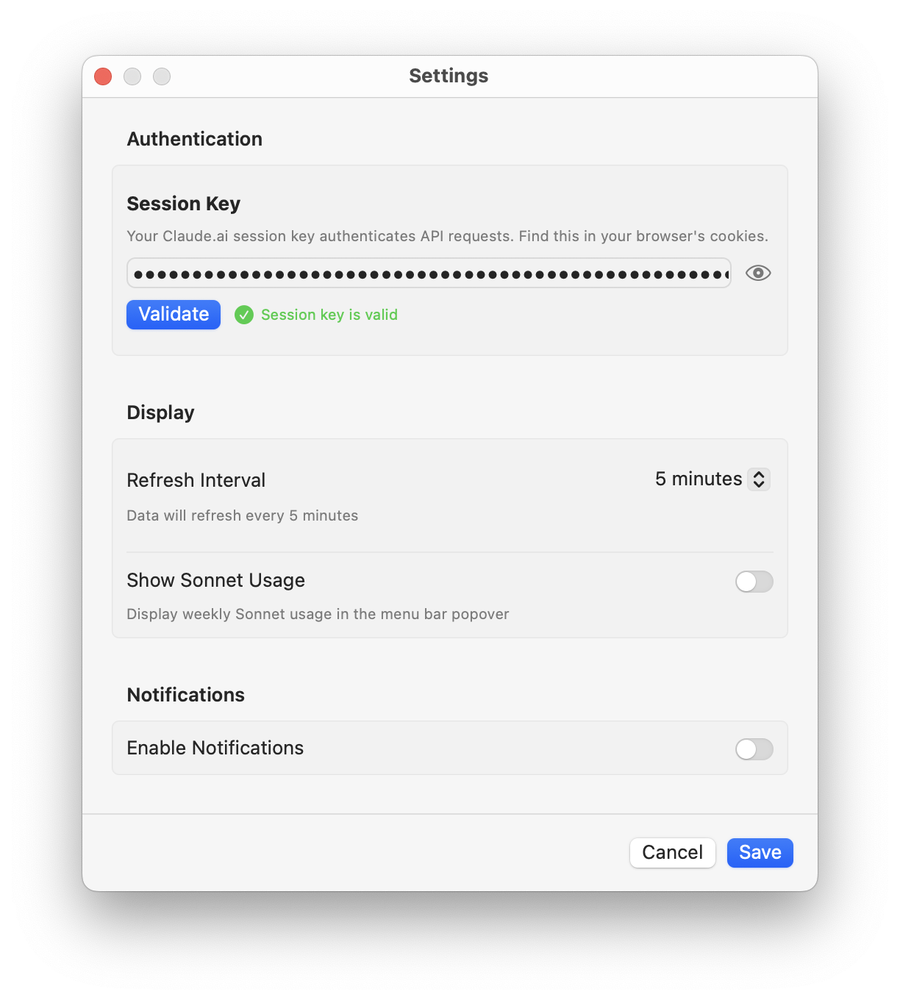
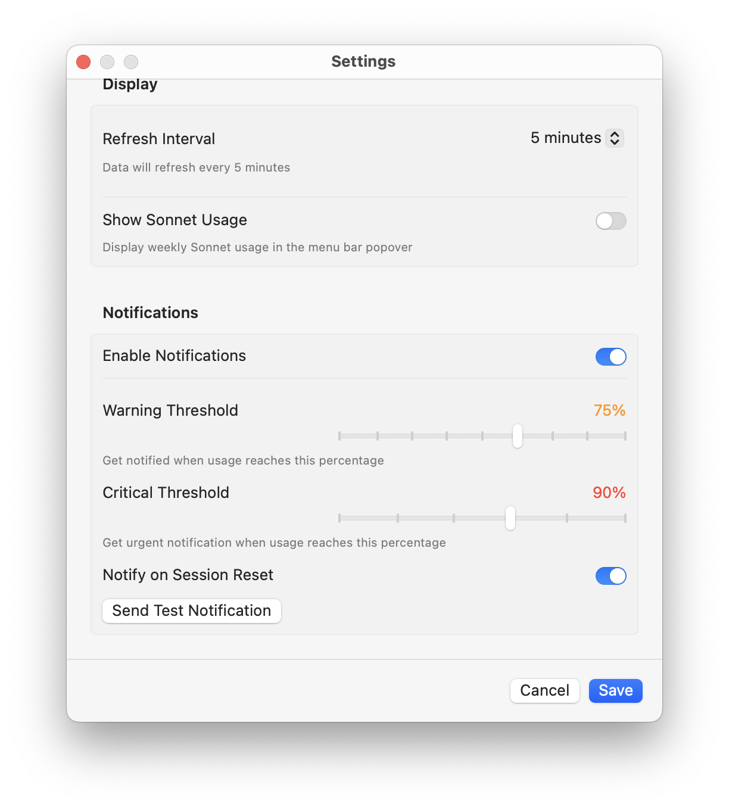

# ClaudeMeter


Keep track of your Claude.ai plan usage at a glance.

## Features

- **Real-time usage monitoring** - Track your 5-hour session, 7-day weekly, and Sonnet-specific usage limits
- **Menu bar integration** - Clean, colour-coded usage indicator that lives in your macOS menu bar
- **Smart notifications** - Configurable alerts at warning and critical thresholds (defaults: 75% and 90%)
- **Auto-refresh** - Automatic usage updates every 1 minute, 5 minutes, or 10 minutes

## Screenshots

### Menu Bar

The menu bar icon changes colour based on your usage levels:

<p align="center">
  
  
  
</p>

When using Sonnet models, an additional indicator shows your Sonnet-specific usage:

<p align="center">
  
</p>

### Notifications

ClaudeMeter sends native macOS notifications when you reach warning or critical thresholds:

<p align="center">
  
</p>

### Settings

<p align="center">
  
  
</p>

### Setup Wizard

<p align="center">
  
</p>

## Installation

1. Download the latest release
2. Move `ClaudeMeter.app` to Applications
3. **Right-click** and select **"Open"** (required for unsigned apps)

If you see "ClaudeMeter is damaged", run:

```bash
xattr -cr /Applications/ClaudeMeter.app
```

## Usage

### First Launch

1. ClaudeMeter appears in your menu bar as a gauge icon
2. The setup wizard will guide you through initial configuration
3. Enter your Claude session key (found in Claude.ai browser cookies)
4. The app validates your key and begins monitoring usage

### Finding Your Session Key

Your Claude session key is stored in your browser cookies:

**Chrome/Edge:**

1. Open [claude.ai](https://claude.ai)
2. Press `F12` to open DevTools
3. Go to Application > Cookies > `https://claude.ai`
4. Find the `sessionKey` cookie (starts with `sk-ant-`)
5. Copy the value

**Safari:**

1. Open [claude.ai](https://claude.ai)
2. Go to Develop > Show Web Inspector (enable Develop menu in Safari preferences if needed)
3. Go to Storage > Cookies > `https://claude.ai`
4. Find the `sessionKey` cookie (starts with `sk-ant-`)
5. Copy the value

**Firefox:**

1. Open [claude.ai](https://claude.ai)
2. Press `F12` to open Developer Tools
3. Go to Storage > Cookies > `https://claude.ai`
4. Find the `sessionKey` cookie (starts with `sk-ant-`)
5. Copy the value

### Daily Use

- Monitor your usage at a glance with the colour-coded menu bar icon
- Click the icon to access detailed statistics and adjust settings
- Receive automatic notifications when reaching warning or critical thresholds

## Requirements

- macOS 14.0 (Sonoma) or later
- Active Claude.ai account with session key

## Building from Source

```bash
# Clone the repository
git clone https://github.com/eddmann/ClaudeMeter.git
cd ClaudeMeter

# Open in Xcode
open ClaudeMeter.xcodeproj

# Build and run (⌘R)
```

Requires Xcode 16.0 or later.

## Disclaimer

**This is an unofficial tool** and is not affiliated with, endorsed by, or supported by Anthropic PBC.

This application accesses Claude's web API using browser-based authentication methods. **This may violate Anthropic's Terms of Service.** By using ClaudeMeter, you acknowledge that:

- Anthropic may block, restrict, or terminate access at any time
- Your Claude account could be affected by using unofficial API clients
- This app is **unsigned and unnotarized** - macOS will show security warnings on first launch
- **Use at your own risk** - the developer assumes no liability for any consequences

**Data storage:**

- Session keys are stored securely in macOS Keychain (encrypted, device-local only)
- Usage data is cached locally (unencrypted, contains usage percentages only)
- No data is sent to third-party servers or collected by the developer

This software is provided "as is" under the MIT License, without warranty of any kind. **By downloading and using ClaudeMeter, you accept these terms.**

## License

MIT License - see [LICENSE](LICENSE) file for details.
